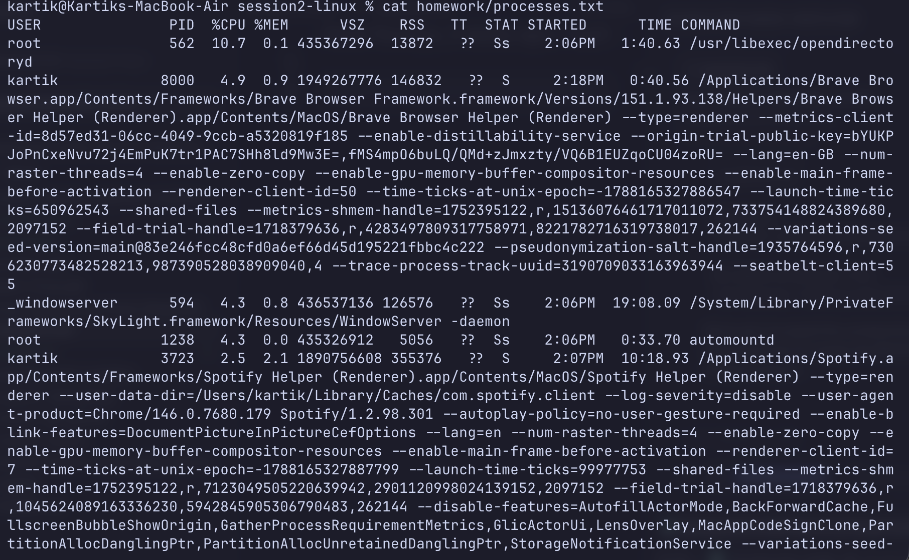
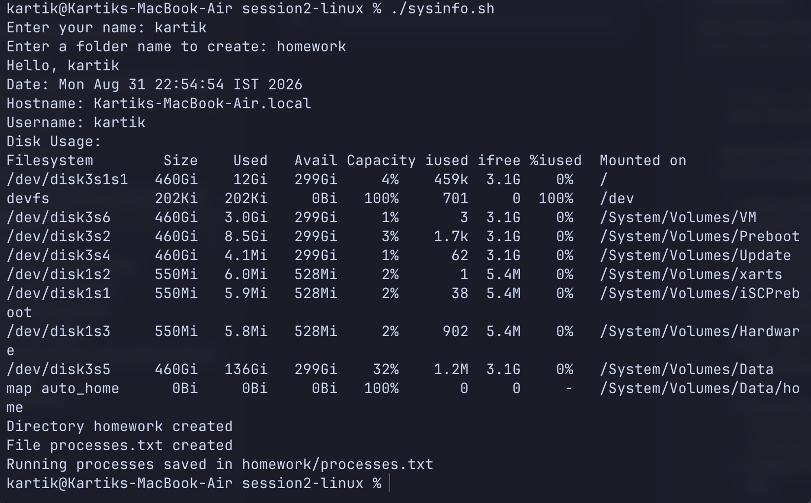

# Session 2 Homework - System Info Script

The homework is done by writing a sysinfo.sh shell script and then running it by ./sysinfo.sh in terminal. The respective outputs are saved as screenshots and shown here.

## Processes File Output

## Terminal Output

