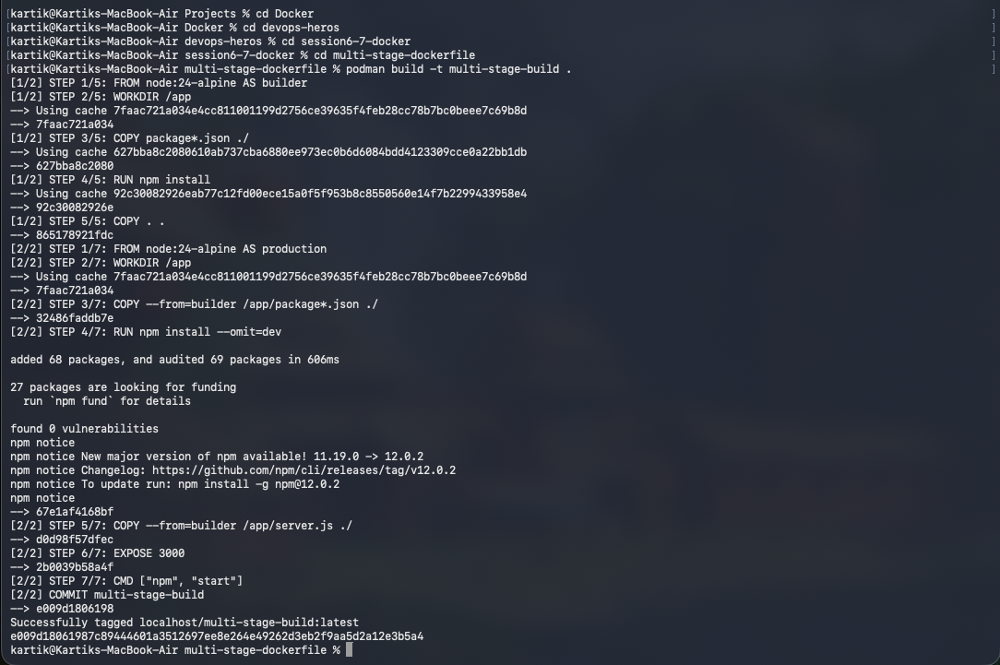
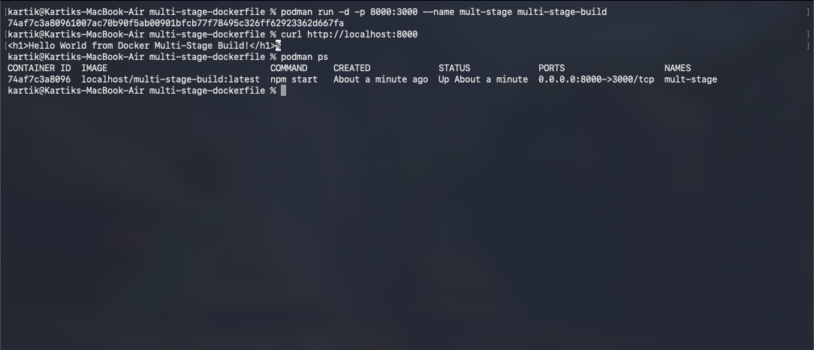

# Session 6-7 Docker - Submission

Name: Kartik
Enrollment Number: 10259

## Task 1 & 2: Multi-Stage Dockerfile

```
$ podman build -t multi-stage-build .
[1/2] STEP 1/5: FROM node:24-alpine AS builder
[1/2] STEP 2/5: WORKDIR /app
[1/2] STEP 3/5: COPY package*.json ./
[1/2] STEP 4/5: RUN npm install
[1/2] STEP 5/5: COPY . .
[2/2] STEP 1/7: FROM node:24-alpine AS production
[2/2] STEP 2/7: WORKDIR /app
[2/2] STEP 3/7: COPY --from=builder /app/package*.json ./
[2/2] STEP 4/7: RUN npm install --omit=dev
added 68 packages, and audited 69 packages in 606ms
found 0 vulnerabilities
[2/2] STEP 5/7: COPY --from=builder /app/server.js ./
[2/2] STEP 6/7: EXPOSE 3000
[2/2] STEP 7/7: CMD ["npm", "start"]
[2/2] COMMIT multi-stage-build
Successfully tagged localhost/multi-stage-build:latest
```



```
$ podman run -d -p 8000:3000 --name mult-stage multi-stage-build
$ curl http://localhost:8000
<h1>Hello World from Docker Multi-Stage Build!</h1>
$ podman ps
CONTAINER ID  IMAGE                              COMMAND     CREATED         STATUS             PORTS                   NAMES
74af7c3a8096  localhost/multi-stage-build:latest  npm start   About a minute  Up About a minute  0.0.0.0:8000->3000/tcp  mult-stage
```



## Task 3: Docker Application Deployment

deployed 3 apps of different types using podman -> node, python and java. built + ran + verified all of them locally first, then pushed to docker hub as evidence.

### Node App (`node-app`)

just express + a single route .

docker hub link - https://hub.docker.com/r/karttikjangid/node-app

```
$ podman build -t node-app .
STEP 1/7: FROM node:24-alpine
STEP 2/7: WORKDIR /app
STEP 3/7: COPY package*.json ./
STEP 4/7: RUN npm install
added 68 packages, and audited 69 packages in 17s
found 0 vulnerabilities
STEP 5/7: COPY . .
STEP 6/7: EXPOSE 3000
STEP 7/7: CMD ["npm", "start"]
COMMIT node-app
Successfully tagged localhost/node-app:latest
```

```
$ podman tag localhost/node-app docker.io/karttikjangid/node-app:latest
$ podman push docker.io/karttikjangid/node-app:latest
Getting image source signatures
Copying blob sha256:4185d8015545b527783a32c7891312952b4a52929af8422538d97ea6616e1371
Copying blob sha256:b2848c02ac6ff53d265469b5b30f649f335e546a83330cd8916d54e65e640409
Copying blob sha256:b8a8ec6b2d08c90e95aaa53437b18fccfe4bddd5a4910ada49c1bf9157d0387d
Copying blob sha256:0f042ad318112da5391c4b621ae5ffda9f10b24fb67ad39616c16f5ded0098a8
Copying blob sha256:fb4554198e262b8e20cf4533831efe750b85a35b6758de5fcb702d19b0f3284d
Copying blob sha256:a035a91abdedd74b09859398be7e66b9c361e8ae30e3efa1af54ef69bfdd5056
Copying blob sha256:ddac2c92f256ce8c67f7d95a9b3a67e29bb3db8ce75ee9a99f4e9ddfe1bd46c1
Copying config sha256:8e08e12a8c559b22bce33d096f3d5902aaee8061ce87d5887e72118c94d09892
Writing manifest to image destination
```

### Python App (`python-app`)

Built with FastAPI, served using uvicorn.

Docker Hub Link: https://hub.docker.com/r/karttikjangid/python-app

```
$ podman build -t python-app .
STEP 1/7: FROM python:3.11-slim
STEP 2/7: WORKDIR /app
STEP 3/7: COPY requirements.txt .
STEP 4/7: RUN pip install -r requirements.txt
Successfully installed fastapi-0.141.1 uvicorn-0.52.4 ...
STEP 5/7: COPY app.py .
STEP 6/7: EXPOSE 8000
STEP 7/7: CMD ["uvicorn", "app:app", "--host", "0.0.0.0", "--port", "8000"]
COMMIT python-app
Successfully tagged localhost/python-app:latest
```

```
$ podman tag localhost/python-app docker.io/karttikjangid/python-app:latest
$ podman push docker.io/karttikjangid/python-app:latest
Getting image source signatures
Copying blob sha256:3e172ec5c71dd5a1e980c3c9497cef0ad2c59fd5a747c28c46e76e828d165e0f
Copying blob sha256:41d6505109809884e681a97f978542a2d4d3506af0124f18b3f3a471edfcc9b7
Copying blob sha256:d84fb4937ce6968f14a6312dcbb90ebf225f777e8f797815fe016226b1962090
Copying blob sha256:879ebba2ddb661058a6b097482c7dfef31be0abb768fd49568c8f1cc0242ebb6
Copying blob sha256:26a996db35b64f97e12464e1ab3b714e22a8a756600ee74d06460affdd9afe09
Copying blob sha256:41c73ea721b750f97d538e09b2537fcd7bdb876536dc5ade4bc35b75fee2e137
Copying blob sha256:7bf6e84bd95b7de48561bb7270bce768dc8a448de9bd73d85da1273a77584d84
Copying config sha256:a8ba38994e96c2e521a6c70d74741c4b3a8cd4c09caa4ea275eac5feb0be7369
Writing manifest to image destination
```

### Java App (`java-app`)

used Java's built in HttpServer for this one, didnt want to deal with maven/gradle for a hello world.

Hub link → https://hub.docker.com/r/karttikjangid/java-app

```
$ podman build -t java-app .
STEP 1/6: FROM eclipse-temurin:21-jdk-alpine
STEP 2/6: WORKDIR /app
STEP 3/6: COPY App.java .
STEP 4/6: RUN javac App.java
STEP 5/6: EXPOSE 8080
STEP 6/6: CMD ["java", "App"]
COMMIT java-app
Successfully tagged localhost/java-app:latest
```

```
$ podman tag localhost/java-app docker.io/karttikjangid/java-app:latest
$ podman push docker.io/karttikjangid/java-app:latest
Getting image source signatures
Copying blob sha256:e93f0d3963cf03b07ed6aadc4d4c940e609b71ea337e742d1c3f4136385d0e08
Copying blob sha256:b2848c02ac6ff53d265469b5b30f649f335e546a83330cd8916d54e65e640409
Copying blob sha256:c8b7dd24f37cc89febf3df1663d89d5ebe3f984a0612ad088ca92252118d13f4
Copying blob sha256:4ed6ce5f819fab899071b0f390ad0e88b5cabe20572c3038c42cea7d44b6c0ae
Copying blob sha256:adcf49336c321016ef6a878b2d279157c54c71eff3615035f7baf884b956c379
Copying blob sha256:54b39a82b316552dd5e4bf3646317889ff0adb3c6cd1fa56211eb2f59128ad54
Copying blob sha256:1513642bf62fca358a3d3ef2651ed5d653435b8f4ac6d1681cb8dfd00b463e5a
Copying config sha256:6af77806899ae30c620f26c24de7fc4da5f534e3650866f61f8c61ed3ddfe5bd
Writing manifest to image destination
```
