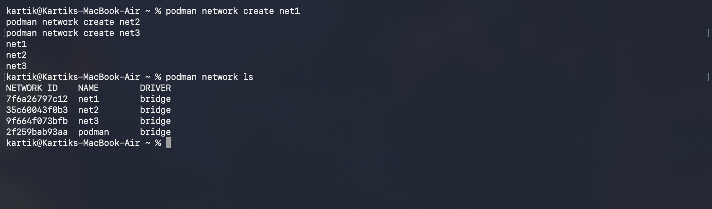
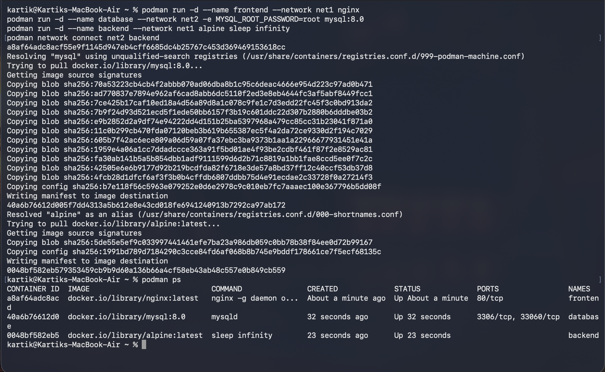
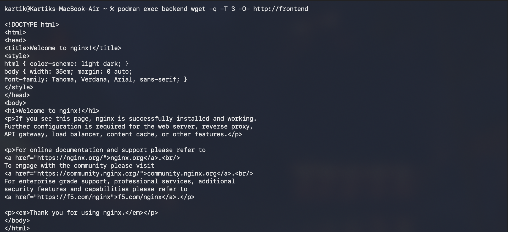
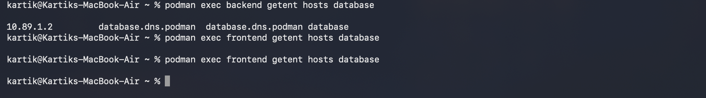
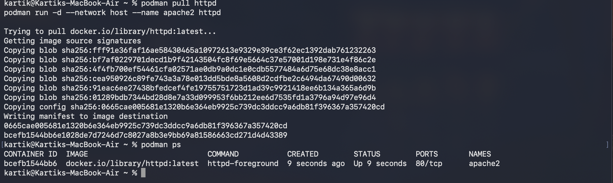
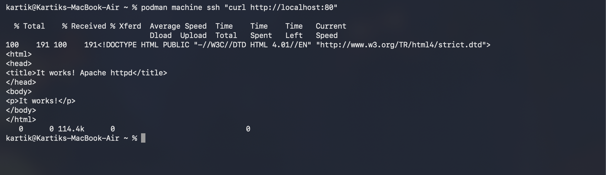
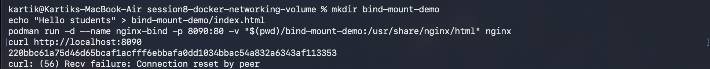
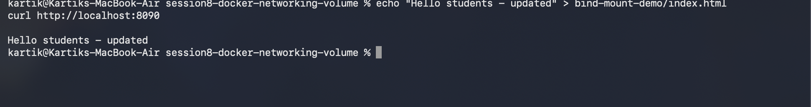

# Docker Networking & Volume Homework

## Task 1: Container Networking

Created 3 networks, put frontend on net1, database on net2, and connected backend to both.

```
$ podman network create net1
$ podman network create net2
$ podman network create net3
$ podman network ls
NETWORK ID    NAME        DRIVER
7f6a26797c12  net1        bridge
35c60043f0b3  net2        bridge
9f664f073bfb  net3        bridge
2f259bab93aa  podman      bridge
```


```
$ podman run -d --name frontend --network net1 nginx
$ podman run -d --name database --network net2 -e MYSQL_ROOT_PASSWORD=root mysql:8.0
$ podman run -d --name backend --network net1 alpine sleep infinity
$ podman network connect net2 backend
$ podman ps
```
all 3 containers up, backend now on net1 and net2.


Connectivity check - used `wget`/`getent` instead of `ping` since rootless podman blocks raw ICMP (ping gave a permission denied error).

backend can reach frontend (same network, net1):
```
$ podman exec backend wget -q -T 3 -O- http://frontend
<!DOCTYPE html>
...
<h1>Welcome to nginx!</h1>
```


backend can resolve database (same network, net2), but frontend cannot resolve database (different networks, no shared network):
```
$ podman exec backend getent hosts database
10.89.1.2       database.dns.podman  database.dns.podman database
$ podman exec frontend getent hosts database
(no output, resolution failed)
```


frontend failing to resolve database is expected, it proves the two networks are actually isolated from each other.

## Task 2: Host Network

Podman blocks binding to port 80 in rootless mode, so switched the podman machine to rootful first:
```
$ podman machine stop
$ podman machine set --rootful
$ podman machine start
```

```
$ podman pull httpd
$ podman run -d --network host --name apache2 httpd
$ podman ps
```


on Mac, podman runs containers inside its own small VM, so `--network host` binds to that VM's network, not directly to the Mac. `http://localhost:80` doesn't load in the Mac browser because of this. checked it's actually working from inside the VM instead:
```
$ podman machine ssh "curl http://localhost:80"
<title>It works! Apache httpd</title>
```


## Task 3: Bind Mount

```
$ mkdir bind-mount-demo
$ echo "Hello students" > bind-mount-demo/index.html
$ podman run -d --name nginx-bind -p 8090:80 -v "$(pwd)/bind-mount-demo:/usr/share/nginx/html" nginx
$ curl http://localhost:8090
curl: (56) Recv failure: Connection reset by peer
```


first curl failed since nginx hadn't fully started yet, retried it a moment later and it worked fine (see next screenshot).

edited the file directly without touching the container, and the change showed up immediately:
```
$ echo "Hello students - updated" > bind-mount-demo/index.html
$ curl http://localhost:8090
Hello students - updated
```


this proves the folder is actually mounted live into the container, not just copied in once.

## Task 4: Overlay Network

A bridge network (used in Task 1) only connects containers on the same machine. an overlay network connects containers running on different physical machines, it uses VXLAN to tunnel the traffic between hosts so the containers can talk to each other like they're on the same LAN even though they're not.

main use case is multi node clusters, like Docker Swarm or Kubernetes - if the same app is spread across 3 different servers, an overlay network lets those containers find and reach each other by name no matter which server they're actually running on. couldn't demo this hands on since it needs multiple physical/virtual hosts and swarm mode, which isnt really practical with a single machine setup.
